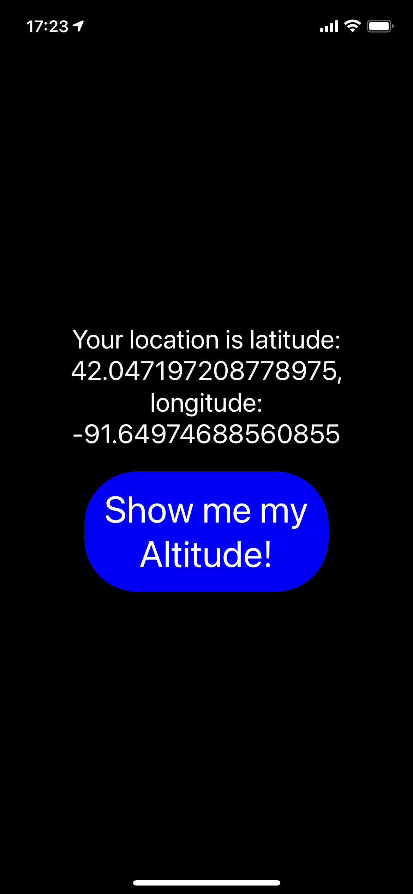
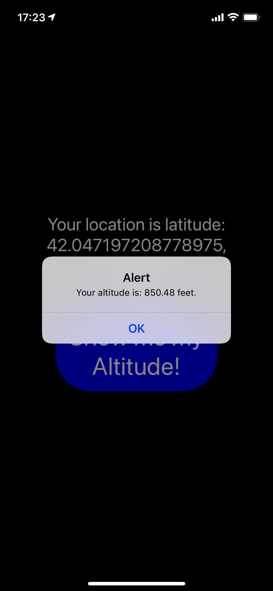

# Expo-Labs

Over the next 2 lab coding sessions, you will create your first Phone App. What it does and how it looks is up to you. This is an opportunity to play around with whats possible in React Native and to get a feel for how you can get into the various device features.

This is a 2-session assignment, after which you will live-demo your phone app to the class (at the start of class 43)

Lab/Coding Session #1 - Focus on getting your dev system up and operational, getting “proof of life” and reaching your MVP in terms of baseline functionality

Lab/Coding Session #2 - Add in the device features, polish, and prepare for deployments.

Deliver your MVP for raw functionality  
Your dev environment should be properly working  
Other users should be able to scan your QR and see your app on any device  
All of your core “features” should be working properly  
Un-Styled is fine. We’re looking for things to buzz, light up, detect movement, etc.  

# Current version

# Why
This app will allow you to see your current location in latitude and longitude. Currently there also exists a button that when clicked shows the current elevation in feet. 
Future versions will allow a user to watch a given location and be notified when they move away from it. 
